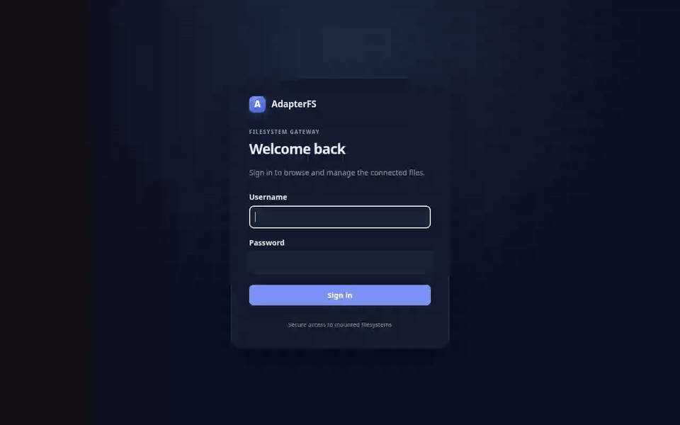

# AdapterFS

AdapterFS turns a mounted directory into a small, self-contained file gateway. Run it beside an existing application container and the same files become available through a browser, WebDAV, SFTP, FTP, and an S3-compatible API.



## What it provides

- A responsive file manager with drag-and-drop uploads, downloads, folders, rename, move, deletion, filtering, and light/dark themes
- Named filesystem exports shared by every interface
- WebDAV Class 1 operations, SFTP, optional FTP, and a SigV4-authenticated S3 API with ranges, copy, presigned URLs, and multipart uploads
- Generated persistent local credentials, optional OIDC browser login, and dedicated S3 access keys
- A non-root Chainguard JRE image, GraalVM native image, Helm chart, and ephemeral-container helper
- Health probes and Prometheus metrics without a database or external web assets

AdapterFS reads and writes ordinary files directly. A change made over SFTP appears in the browser and through S3 on the next request.

## Docker quick start

```bash
mkdir -p files adapterfs-state
docker run --rm \
  -p 8080:8080 -p 9000:9000 -p 2222:2222 \
  -v "$PWD/files:/data" \
  -v "$PWD/adapterfs-state:/var/lib/adapterfs" \
  ghcr.io/wenisch-tech/adapterfs:latest
```

Open <http://localhost:8080>. The first start creates the web/protocol password and S3 keys in `adapterfs-state/credentials.json`; the file is mode `0600`. Read them with:

```bash
docker exec <container> java -jar /app/adapterfs.jar --print-credentials
# Native image: docker exec <container> /app/adapterfs --print-credentials
# or inspect adapterfs-state/credentials.json on the host
```

For unattended deployments, set `ADAPTERFS_AUTH_USERNAME`, `ADAPTERFS_AUTH_PASSWORD`, `ADAPTERFS_AUTH_S3_ACCESS_KEY`, and `ADAPTERFS_AUTH_S3_SECRET_KEY` from secrets.

## Connect

With the default `files` export:

```bash
# WebDAV
curl -u admin:password -X PROPFIND -H 'Depth: 1' http://localhost:8080/dav/files/

# SFTP
sftp -P 2222 admin@localhost

# S3 (path-style addressing)
AWS_ACCESS_KEY_ID=... AWS_SECRET_ACCESS_KEY=... \
  aws --endpoint-url http://localhost:9000 s3 ls s3://files/

# FTP, after explicitly enabling it
curl -u admin:password ftp://localhost:2121/files/
```

The WebDAV and browser endpoint normally use TLS at the ingress. SFTP encrypts its transport. FTP is disabled by default because plain FTP exposes credentials and content; enable it only on a protected network.

## Configure exports

Exports are configured with Spring Boot YAML. Names must be valid lowercase S3 bucket names and become top-level directories in SFTP/FTP, WebDAV paths, and S3 bucket names.

```yaml
adapterfs:
  state-directory: /var/lib/adapterfs
  exports:
    - name: uploads
      path: /data/uploads
      read-only: false
    - name: archives
      path: /data/archives
      read-only: true
```

For a single export, the default environment variables are convenient:

| Variable | Default | Purpose |
| --- | --- | --- |
| `ADAPTERFS_EXPORT_NAME` | `files` | Export/bucket name |
| `ADAPTERFS_EXPORT_PATH` | `/data` | Mounted directory |
| `ADAPTERFS_EXPORT_READ_ONLY` | `false` | Deny mutations |
| `ADAPTERFS_STATE_DIRECTORY` | `/var/lib/adapterfs` | Credentials, host key, multipart state |
| `ADAPTERFS_HTTP_PORT` | `8080` | Browser, REST, WebDAV, health |
| `ADAPTERFS_S3_PORT` | `9000` | S3 endpoint |
| `ADAPTERFS_SFTP_PORT` | `2222` | SFTP endpoint |
| `ADAPTERFS_FTP_ENABLED` | `false` | Enable FTP explicitly |
| `ADAPTERFS_FTP_PORT` | `2121` | FTP control port |
| `ADAPTERFS_FTP_PASSIVE_PORTS` | `30000-30009` | FTP passive data ports |
| `ADAPTERFS_FTP_TLS_ENABLED` | `false` | Enable explicit TLS (`AUTH TLS`) |

For explicit FTPS, also set `ADAPTERFS_FTP_TLS_KEYSTORE` to a PKCS12/JKS keystore and provide `ADAPTERFS_FTP_TLS_KEYSTORE_PASSWORD` through a secret.

Multiple exports can use indexed environment variables such as `ADAPTERFS_EXPORTS_0_NAME`, `ADAPTERFS_EXPORTS_0_PATH`, and `ADAPTERFS_EXPORTS_0_READ_ONLY`, or a mounted YAML file.

AdapterFS rejects `..` traversal, symbolic links anywhere inside an exported path, device/special files, and cross-export moves. Uploads are written to a temporary sibling and renamed into place. Existing destinations return a conflict unless the caller explicitly requests overwrite.

## Kubernetes sidecar

A sidecar mounts the same volume in the same pod. This works with `ReadWriteOnce` and `ReadWriteOncePod`; it does not require `ReadWriteMany`.

Use the chart's reusable `adapterfs.container` named template from a parent chart, or copy its rendered container block into the existing workload. Mount the application volume and AdapterFS state into the sidecar:

```yaml
containers:
  - name: application
    volumeMounts:
      - {name: shared-data, mountPath: /app/uploads}
  - name: adapterfs
    image: ghcr.io/wenisch-tech/adapterfs:latest
    env:
      - {name: ADAPTERFS_EXPORT_NAME, value: uploads}
      - {name: ADAPTERFS_EXPORT_PATH, value: /data/uploads}
    volumeMounts:
      - {name: shared-data, mountPath: /data/uploads}
      - {name: adapterfs-state, mountPath: /var/lib/adapterfs}
```

The chart does not inject a sidecar into existing workloads. To create only Services and supporting resources, set `deployment.enabled=false` and set `service.selector` to labels on the existing pod.

## Helm

```bash
helm install adapterfs \
  oci://ghcr.io/wenisch-tech/helm-charts/adapterfs \
  --namespace adapterfs --create-namespace
```

For a standalone deployment, mount existing volumes through `extraVolumes` and `extraVolumeMounts`, then describe matching `exports`. Use `credentials.existingSecret` in production; it must contain `username`, `password`, `s3-access-key`, and `s3-secret-key`. The generated Secret remains stable across Helm upgrades.

The browser/WebDAV ingress covers port 8080. Expose SFTP, S3, and FTP with Services appropriate to the cluster. FTP additionally needs every configured passive port routed to the pod.

## Temporary attachment

`scripts/kubectl-adapterfs` appends an ephemeral container and mounts volumes already declared on a running pod. It does not restart or modify application containers and cannot expose their private image layers.

```bash
scripts/kubectl-adapterfs my-pod -n my-namespace \
  --mount application-data:files \
  --mount archive-volume:archive:ro
```

The command checks `pods/ephemeralcontainers` permission, prints temporary credentials, a `kubectl port-forward` command, and an authenticated stop command. Sessions expire after one hour unless `--duration` changes it. A stopped ephemeral-container record remains on the pod until Kubernetes replaces that pod, so use a different `--name` or replace the pod for another session.

## OIDC

Local login remains available when OIDC is enabled. Configure Spring Security's `adapterfs` registration and an allowlist:

```yaml
spring.security.oauth2.client:
  registration.adapterfs:
    client-id: adapterfs
    client-secret: ${OIDC_CLIENT_SECRET}
    scope: [openid, profile, email]
  provider.adapterfs.issuer-uri: https://id.example.com/realms/main
adapterfs.auth:
  oidc-allowed-subjects: ["248289761001"]
  oidc-allowed-groups: ["storage-operators"]
```

An authenticated identity is denied unless its `sub` claim or one of its `groups` claims is explicitly listed. OIDC applies to the browser; FTP/SFTP/WebDAV use the local account and S3 uses its access keys.

## Compatibility and limits

- S3 supports fixed configured buckets, SigV4 header and query authentication, path-style access, ListBuckets/ListObjectsV2, HEAD/GET/ranges, PUT, copy, delete, presigned URLs, and multipart create/upload/complete/abort.
- Bucket creation/deletion, versioning, policies, ACLs, events, object lock, tagging, and virtual-host bucket addressing are outside v1.
- WebDAV supports Class 1 file operations. Locking (`LOCK`/`UNLOCK`) is not implemented.
- Symbolic links are deliberately hidden and rejected. AdapterFS does not preserve S3 metadata outside normal file attributes.
- One AdapterFS process should own its state directory. Files may be changed externally, and listings always read current filesystem state.
- SFTP and FTP expose named exports from a state-directory gateway. Their protocol hooks reject mutations to read-only exports; mounting those exports read-only at the container level adds defense in depth.

## Operations and troubleshooting

- Liveness: `/actuator/health/liveness`
- Readiness: `/actuator/health/readiness`
- Prometheus: `/actuator/prometheus`
- A startup failure means an export is invalid, the state directory is unwritable, or an enabled listener cannot bind.
- `403 SignatureDoesNotMatch` usually means the client clock, endpoint, region, access keys, or path-style setting differs from the signed request.
- SFTP host keys live under the state directory. Persist that directory to avoid host-key warnings after a restart.
- For FTP behind NAT, set `ADAPTERFS_FTP_EXTERNAL_ADDRESS` and publish the complete passive range.

## Development

Requires Java 25 and Maven 3.9+:

```bash
./mvnw verify
./mvnw spring-boot:run
./mvnw -Pnative native:compile
```

Run the signed S3 exercise against a local instance with `scripts/s3-smoke.py`. `scripts/check-protocols.sh <image>` validates browser/API, WebDAV, SFTP, FTP, and S3 against a container. Browser journeys live under `tests/e2e`; `npm test` runs them against `ADAPTERFS_BASE_URL`.

Recreate the README animation from the running application:

```bash
npm install
npx playwright install chromium
ADAPTERFS_BASE_URL=http://localhost:8080 ADAPTERFS_USERNAME=admin ADAPTERFS_PASSWORD=... npm run record-demo
```

GitHub Actions test every change, build amd64/arm64 JVM images and an amd64 native image, run blocking protocol smoke tests, generate SBOM/provenance artifacts, and publish the chart to `oci://ghcr.io/wenisch-tech/helm-charts/adapterfs`. The workflow needs repository `contents: write`, `packages: write`, `id-token: write`, and `attestations: write`; organization package creation must permit this repository.

## License

AdapterFS is licensed under the [GNU Affero General Public License v3.0](LICENSE).
